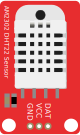

# Fritzing Parts

I've been using [Fritzing](http://fritzing.org) to draw up diagrams for IoT projects that I'm working on. Sharing any custom parts that I end up putting together.

Feel free to download and remix, based on the [ShareALike 3.0](LICENSE.txt) license.

# Parts
## AM2302 DHT22 Humidity and Temperature Sensor Module
Basically a DHT22 with a built-in pull-up resistor for the data line. Includes breadboard, schematic and PCB. Based on the DHT22 from the [Adafruit Fritzing library](https://github.com/adafruit/Fritzing-Library).

